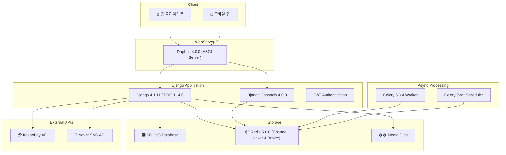
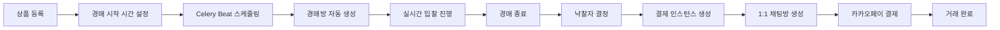

# 📦 실시간 경매 플랫폼 (Real-time Auction Platform)

이 리포지토리는 팀 프로젝트 [realtime_auction](https://github.com/wodnrP/realtime_auction)를 포크하여 포트폴리오용으로 제가 기여한 부분을 상세히 기술하기 위해 작성되었습니다.     
Django Channels와 Celery를 활용하여 구축한 **실시간 경매 플랫폼 팀 프로젝트** 의 기술적 개요와 핵심 기능을 설명합니다.   
실시간 입찰, 자동화된 경매 관리, 결제 시스템 등 복잡한 비즈니스 로직을 안정적이고 확장 가능하게 구현하는 것을 목표로 진행되었습니다.

<br>

## 목차

[아키텍처](https://github.com/ramyo564/realtime_auction#%EF%B8%8F-%EC%95%84%ED%82%A4%ED%85%8D%EC%B2%98-architecture)   
[주요기능](https://github.com/ramyo564/realtime_auction#-%EC%A3%BC%EC%9A%94-%EA%B8%B0%EB%8A%A5-key-features)    
[제가 기여한 부분 (My Contribution)](https://github.com/ramyo564/realtime_auction#-%EC%A0%9C%EA%B0%80-%EA%B8%B0%EC%97%AC%ED%95%9C-%EB%B6%80%EB%B6%84-my-contribution)   
[설치 및 API 상세 명세 + 동영상](https://github.com/ramyo564/realtime_auction#-%EC%84%A4%EC%B9%98-%EB%B0%8F-api-%EC%83%81%EC%84%B8-%EB%AA%85%EC%84%B8--%EB%8F%99%EC%98%81%EC%83%81)    
[기술스택](https://github.com/ramyo564/realtime_auction#-%EA%B8%B0%EC%88%A0-%EC%8A%A4%ED%83%9D-tech-stack)

## 🏗️ 아키텍처 (Architecture)

실시간 통신과 비동기 작업 처리를 효율적으로 수행하기 위해 아래와 같은 아키텍처로 설계되었습니다.



- **Daphne ASGI 서버**: HTTP 요청과 WebSocket 연결을 모두 처리
- **Django Channels**: WebSocket 기반 실시간 통신 담당
- **Redis**: Channel Layer(실시간 통신)와 Celery Broker(비동기 작업) 역할
- **Celery**: 경매방 자동 생성, 결제 처리 등 백그라운드 작업

<br>

## ✨ 주요 기능 (Key Features)

### 🎯 실시간 경매 시스템
<details>
<summary><b> 펼치기 👈 </b></summary>
<div markdown="1">
	
- **실시간 입찰:**

	- WebSocket(Django Channels)을 통해 다수의 사용자가 지연 없이 입찰에 참여하고, 최고가가 실시간으로 모든 클라이언트에 동기화됩니다.
- **동시 입찰 처리:** 
	- `@database_sync_to_async`를 활용하여 다수의 입찰이 동시에 발생하더라도 데이터 정합성을 보장하며 최고가를 안전하게 갱신합니다.
- **자동화된 경매 관리:** 
	- Celery Beat를 이용해 10초마다 `check_and_create_auction_rooms` 작업을 실행하여 지정된 시간에 경매가 자동으로 시작되고, 설정된 시간이 되면 자동으로 종료되는 생명주기를 관리합니다.
</div>
</details>

### 🛒 상품 관리 시스템
<details>
<summary><b> 펼치기 👈 </b></summary>
<div markdown="1">
	
- **계층형 카테고리:**

	- `django-mptt`를 활용한 트리 구조 카테고리 시스템으로 상품을 체계적으로 분류합니다.
- **다중 이미지 지원:** 
	- `ProductImages` 모델을 통해 상품별 다중 이미지 업로드 및 관리가 가능합니다.
- **동적 필터링:** 
	- `ProductsFilter`를 통해 상품명(keyword)과 카테고리별 검색이 가능하며, 페이지네이션으로 효율적인 데이터 로딩을 제공합니다.
- **자동 경매 기간 설정:** 
	- 상품 등록 시 자동으로 3일간의 경매 기간이 설정되며, `auction_start_at`과 `auction_end_at`으로 세밀한 시간 관리가 가능합니다.
</div>
</details>

### 💲 커뮤니케이션 및 결제
<details>
<summary><b> 펼치기 👈 </b></summary>
<div markdown="1">
	
- **1:1 실시간 채팅:**

	- 경매 종료 시, 판매자와 낙찰자 간의 1:1 채팅방이 자동으로 생성되어 원활한 거래를 지원합니다.
- **카카오페이 결제 연동:** 
	- REST API를 통해 카카오페이 결제 시스템을 연동하여, 사용자가 안전하고 편리하게 낙찰된 상품을 결제할 수 있습니다.
- **자동 결제 생성:** 
	- 경매 완료 시 `create_payment_for_auction_winner` Celery 작업으로 자동으로 결제 인스턴스가 생성됩니다.
- **결제 만료 관리:** 
	- 15분(테스트) / 2일(운영) 후 미결제 건은 자동으로 삭제되어 시스템 리소스를 최적화합니다.
</div>
</details>

### 👤 사용자 및 인증
<details>
<summary><b> 펼치기 👈 </b></summary>
<div markdown="1">
	
- **전화번호 기반 인증:**

	- 커스텀 User 모델을 통해 전화번호를 주요 식별자로 사용하는 인증 시스템을 구축했습니다.
- **SMS 인증 시스템:** 
	- Naver Cloud SMS API를 활용한 휴대폰 인증번호 발송 및 검증 기능을 제공합니다.
- **JWT 토큰 기반 인증:** 
	- `rest_framework_simplejwt`를 활용하여 모바일 앱 등 다양한 클라이언트 환경에 유연하게 대응할 수 있는 토큰 기반 인증 시스템을 구축했습니다.
</div>
</details>

### 🔑 보안 및 관리 기능
<details>
<summary><b> 펼치기 👈 </b></summary>
<div markdown="1">
	
- **신고 시스템:**

	- 채팅 중 욕설(PROFANITY), 광고(ADVERTISEMENT), 스팸(SPAM) 등 부적절한 내용을 신고할 수 있는 시스템을 제공합니다.
- **위시리스트:** 
	- 사용자가 관심 있는 상품을 위시리스트에 추가하여 추후 경매 참여를 준비할 수 있습니다.
- **패널티 시스템:** 
	- 부적절한 행위에 대한 패널티 관리 시스템으로 안전한 경매 환경을 조성합니다.

</div>
</details>

### ⚙️ 데이터 관리 및 최적화
<details>
<summary><b> 펼치기 👈 </b></summary>
<div markdown="1">
	
- **실시간 데이터 동기화:**

	- Redis Channel Layer를 통해 실시간 입찰 정보와 채팅 메시지가 모든 참여자에게 즉시 전달됩니다.
- **비동기 작업 처리:** 
	- Celery Worker를 통해 경매방 생성, 결제 처리, 채팅방 생성 등 무거운 작업을 백그라운드에서 처리합니다.
- **이미지 처리:** 
	- Pillow를 활용한 이미지 업로드 및 처리 시스템으로 상품 이미지를 효율적으로 관리합니다.
</div>
</details>
<br>

### 🔄 자동화된 워크플로우



### 🎨 사용자 경험 (UX) 특징

- **실시간 피드백:**

	- 입찰 시 즉시 최고가 갱신 및 입찰자 정보가 모든 참여자에게 실시간으로 표시됩니다.
- **직관적인 인터페이스:** 
	- WebSocket을 통한 실시간 업데이트로 사용자가 지연 없이 경매에 참여할 수 있습니다.
- **안전한 결제:** 
	- 카카오페이의 검증된 결제 시스템을 통해 안전하고 신뢰할 수 있는 결제 환경을 제공합니다.
- **개인화된 서비스:** 
	- 위시리스트, 개인 프로필, 참여 경매 히스토리 등 개인화된 기능을 제공합니다.

<br>

## 🔥 제가 기여한 부분 (My Contribution)

이 프로젝트에서 저는 **카카오페이 결제 시스템 전체 플로우**와 **검색 성능 최적화**, 그리고 **견고한 상품 API 설계**를 담당했습니다.    
특히 프론트엔드가 없는 개발 환경의 제약을 극복하고, 복잡한 비즈니스 로직을 안정적으로 구현하는 데 집중했습니다.

<br>

### 📌 1. 카카오페이 결제 시스템 전체 플로우 구현

단순 API 호출을 넘어, 실제 결제 과정에서 발생하는 상태 관리 문제를 해결하며 전체 결제 플로우를 책임지고 구현했습니다.

- **기술적 과제:**

	- 카카오페이 결제는 `결제 준비(ready)`와 `결제 승인(approval)`이라는 두 단계의 API 호출로 이루어집니다. 
	- `준비` 단계에서 받은 `tid`(거래 고유번호)를 `승인` 단계에서 사용해야 하는데, 프론트엔드가 없는 개발 환경에서 이 상태(state)를 안전하고 일관되게 유지하는 것이 가장 큰 문제였습니다.
- **해결 방안:**
    1. **임시 전역 변수를 이용한 상태 관리:**
    
	    - 당시 개발 환경의 제약(쿠키/세션 사용 불가)을 극복하기 위해, **Python 딕셔너리(Dictionary)를 전역 변수로 활용**했습니다. 
	    - 사용자의 고유 식별자(휴대폰 번호)를 Key로, `tid`와 `payment_pk`를 Value로 저장하여 `준비`와 `승인` 단계를 논리적으로 연결했습니다. 
	    - 이는 동시 결제가 불가능한 상황과 O(1)의 시간 복잡도를 고려한 합리적인 선택이었습니다.
    3. **결제 만료 로직 구현:** 
	    - 사용자가 결제를 시작했지만 15분(테스트 환경) 이상 완료하지 않을 경우, 해당 결제 정보를 DB에서 자동으로 삭제하는 로직을 구현했습니다. 
	    - 이를 통해 불필요한 데이터가 쌓이는 것을 방지하고 시스템을 최적화했습니다.
    4. **독자적인 테스트 환경 구축:** 
	    - 기능 구현을 증명하기 위해, `HTML`과 `JavaScript`로 간단한 테스트용 프론트엔드 페이지(`payment_list.html`, `payment_approval.html`)를 직접 만들어 API 호출 및 전체 결제 과정을 시연하고 검증했습니다.

<br>

### 📌 2. 검색 성능 최적화 및 데이터 모델링 개선

사용자가 원하는 상품을 빠르고 정확하게 찾을 수 있도록, 검색 기능의 핵심 로직과 데이터 구조를 개선했습니다.

- **기술적 과제:**

	- 단순한 DB `LIKE` 검색은 대량의 데이터에서 성능 저하를 일으킬 수 있으며, 여러 단계의 카테고리를 효율적으로 관리하고 필터링하는 데 한계가 있었습니다.
- **해결 방안:**
    1. **django-filter를 활용한 검색 최적화:**
    
       - 상품명 키워드 검색과 카테고리 필터링을 위해 `django-filter`의 `CharFilter`를 활용했습니다.
       - `icontains` lookup을 사용하여 대소문자 구분 없이 검색이 가능하도록 구현했습니다.
    3. **계층형 카테고리 리팩토링:** 
	     - 기존의 단순한 카테고리 모델을 `django-mptt` 라이브러리를 사용하여 **트리(Tree) 구조로 구현**했습니다.
	    - 이로써 '상의 > 티셔츠 > 반팔'과 같은 다중 계층 카테고리를 효율적으로 관리하고, 특정 상위 카테고리에 속한 모든 하위 상품을 조회하는 등의 복잡한 쿼리를 손쉽게 처리할 수 있게 되었습니다.

<br>

### 📌 3. 견고한 상품(경매) API 설계 및 구현

서비스의 핵심인 상품(경매)의 생명주기를 관리하고, 비즈니스 규칙을 적용한 안정적인 REST API를 설계했습니다.

- **기술적 과제:**

	- 누구나 상품을 등록하고 삭제할 수 있다면 데이터 무결성이 깨질 수 있습니다. 
	- 경매의 상태(진행 중, 종료, 낙찰)에 따라 특정 행위(수정, 삭제)를 제한하는 비즈니스 규칙을 API 레벨에서 강제해야 했습니다.
- **해결 방안:**

    1. **권한 기반 API 설계:**
    
	    - JWT 인증을 통해 인증된 사용자만 상품을 등록할 수 있도록 API를 설계했습니다.
    2. **상태 기반 로직 적용:** 
	    - 상품 삭제(`DELETE /products/<pk>/delete`) API의 경우, 단순히 요청자를 확인하는 것을 넘어 **"본인이 등록한 상품"** 이면서 **"경매가 진행 중이 아닐 때"** 만 삭제가 가능하도록 비즈니스 로직을 추가하여 데이터의 무결성을 지켰습니다.
    3. **다중 이미지 처리:** 
	    - 상품 하나에 여러 이미지를 등록할 수 있도록 `ProductImages` 모델을 설계하고, 관련 API 및 시리얼라이저를 구현하여 사용 편의성을 높였습니다.

<br>


## 🔧 설치 및 API 상세 명세 + 동영상

<details>
<summary><b> 📄 설치 가이드 및 전체 API 명세 보기 (클릭) </b></summary>
<div markdown="1">


| HTTP method | 기능                     | end-point                    | auth required |
| ----------- | ------------------------ | ---------------------------- | ------------- |
| GET         | 낙찰상품조회             | /payments/winning-bid-list   | O             |
| POST        | 카카오페이 결제준비      | /payments/kakao-pay-ready    | O             |
| GET         | 카카오페이 결제준비 조회 | /payments/kakao-pay-ready    | O             |
| POST        | 카카오페이 결제승인      | /payments/kakao-pay-approval | O             |
| GET         | 카카오페이 결제승인 조회 | /payments/kakao-pay-approval | O             |
| GET         | 카카오페이 결제취소 조회 | /payments/kakao-pay-cancel   | O             |
| GET         | 카카오페이 결제실패 조회 | /payments/kakao-pay-fail     | O             |
| ----------- | ------------------ | ---------------------------------- | ------------- |
| GET         | 경매상품조회           | /products/all-products             | X             |
| POST        | 경매등록           | /products/new-product              | O             |
| DELETE      | 경매삭제           | /products/<str:pk>delete           | O             |
| POST        | 이미지등록         | /products/upload-images            | O             |
| GET         | 경매상품이미지조회 | /products/images/<str:products_id> | O             |
|             |                    |                                    |               |


### 결제과정
---- 
#### 초기 환경 설정
- 초기설정
	- 모든 앱의 migrations 폴더 안에 `__init__.py`파일 밑에 숫자로 시작하는 파일들 삭제
		- ex) 0001.py
	- db.sqlite3 삭제
	- `python manage.py makemigrations`
	- `python manage.py migrate`
	- `python manage.py createsuperuser`
	- 위 순서로 진행하면 됩니다.
- 그 이후 레디스나 셀러리 서버를 켜주는건 이전과 동일하게 진행하면 됩니다.

`이미지 파일을 클릭하면 빨리감기가 가능합니다`
  
[](https://vimeo.com/1000162498?share=copy)


#### 카카오페이 결제 API 사용 과정

##### 상품등록과정 + 채팅과정 (테스트 확인)

`이미지 파일을 클릭하면 빨리감기가 가능합니다`

[](https://vimeo.com/1000164866?share=copy)

##### 카카오페이 결제과정 (테스트 확인)

`이미지 파일을 클릭하면 빨리감기가 가능합니다`

[](https://vimeo.com/1000165433?share=copy)

###### 낙찰목록 불러오기

- 사용자가 프론트단에서 낙찰된 상태에서 payment_list (마이페이지에서 결제목록) 을 클릭을 트리거로 실시간으로 결제목록이 업데이트 됩니다. 테스트는 아래와 같습니다.
	- 결제 안하고 시간 초과
	- 결제 안했지만 아직 결제할 시간 남은 경우 (영상에서는 일괄적으로 불러와져서 전부 삭제되지만 실제로는 정상작동합니다)
	- 결제 완료
	- 낙찰자 없이 끝난 경우
- 상품이 삭제될 경우 제품도 삭제되기 때문에 다음과 같은 상황을 생각해봐야 될 것 같습니다.
	- 상대방이 결제를 했을 경우 PROTECT로 payment 데이터를 보호 하던가 최종 결제된 상품은 판매자가 해당 상품을 삭제 할 수 없도록 비공개로 해놔야함

### 프론트 테스트 파일

- payment_list.html

```html
<!DOCTYPE html>
<html>
<head>
    <meta charset="utf-8"/>
    <title>Payments</title>
</head>

<style>
    div {
        font-size: 30px;
        margin-bottom: 10px;
    }
    div>button {
        font-size: 20px;
    }
</style>
<body>
    <h2>Payments</h2>
    Check out your list<br>
    
    <div id="payment-list"></div>
    
    <script>
        
        const accessToken = localStorage.getItem('access');
        console.log(accessToken);
        
        // Cookie에서 특정 이름의 값을 가져오는 함수
        function getCookie(name) {
        let cookieValue = null;
            if (document.cookie && document.cookie !== '') {
                const cookies = document.cookie.split(';');
                for (let i = 0; i < cookies.length; i++) {
                    const cookie = cookies[i].trim();
                    // Does this cookie string begin with the name we want?
                    if (cookie.substring(0, name.length + 1) === (name + '=')) {
                        cookieValue = decodeURIComponent(cookie.substring(name.length + 1));
                        break;
                    }
                }
            }
        return cookieValue;
        }
        // paymentID 쿠키 생성 ###########3
        function setCookie(name, value, days) {
            const date = new Date();
            date.setTime(date.getTime() + (days * 24 * 60 * 60 * 1000));
            const expires = "expires=" + date.toUTCString();
            document.cookie = name + "=" + value + ";" + expires + ";path=/";
        }
        
        // JavaScript 함수 정의
        function payWithKakaoPay(paymentId, csrftoken) {
            console.log('Payment ID:', paymentId);
            setCookie('paymentId', paymentId, 30); // 쿠키 설정###########
            fetch('http://localhost:8000/payments/kakao-pay-ready', {
                method: 'POST',
                headers: {
                    'Authorization': `Bearer ${accessToken}`,
                    'Content-Type': 'application/json',
                    'X-CSRFToken': getCookie('csrftoken'),
                    'Cookie': 'paymentId=' + paymentId
                },
                body: JSON.stringify({ paymentId: paymentId }),

            })
            .then(response => response.json())
            .then(data => {
                // 서버로부터의 응답을 처리
                console.log('Response from server:', data);
            })
            .catch(error => {
                // 에러 처리
                console.error('Error:', error);
            });
            console.log(csrftoken);
        }

        const enterPaymentList = (payId) => {
            localStorage.setItem('payments', payId);
            location.replace('payment.html');
        }

        const PaymentList = async () => {
            const res = await fetch('http://localhost:8000/payments/winning-bid-list', {
                headers: {
                    'Authorization': `Bearer ${accessToken}`,
                    'content-type': 'application/json',
                    'X-CSRFToken': getCookie('csrftoken') // CSRF 토큰을 요청 헤더에 추가
                },
                method: 'GET'
            });

            const resJsonData = await res.json();
            console.log(resJsonData);
            
            let paymentHtml = '';
            resJsonData.forEach(payment => {
                paymentHtml += `
                    <div>
                        <span>ID: ${payment.id}</span>
                        <span>Product Name: ${payment.product_name}</span>
                        <span>Total Price: $${payment.total_price}</span>
                        <span>Payment Type: ${payment.payment_type}</span>
                        <span>Payment Date: ${payment.payment_date}</span>
                        <button onclick="payWithKakaoPay(${payment.id})">결제하기</button>
                    </div>
                `;
                
                
            });
            const paymentList = document.getElementById('payment-list');
            paymentList.innerHTML = paymentHtml;
        }

        PaymentList();

    </script>
</body>
</html>

```

- payment_approval.html

```html
<!DOCTYPE html>
<html>
<head>
    <meta charset="utf-8"/>
    <title>Payment Approval</title>
</head>
<body>
    <h2>Payment Approval</h2>
    <!-- 다양한 HTML 내용 -->

    <script>
        const accessToken = localStorage.getItem('access');
    
        console.log(accessToken);
        // Cookie에서 특정 이름의 값을 가져오는 함수
        function getCookie(name) {
            let cookieValue = null;
            if (document.cookie && document.cookie !== '') {
                const cookies = document.cookie.split(';');
                for (let i = 0; i < cookies.length; i++) {
                    const cookie = cookies[i].trim();
                    // Does this cookie string begin with the name we want?
                    if (cookie.substring(0, name.length + 1) === (name + '=')) {
                        cookieValue = decodeURIComponent(cookie.substring(name.length + 1));
                        break;
                    }
                }
            }
            return cookieValue;
        }
        
        // URL 쿼리 매개변수 생성
        const urlParams = new URLSearchParams(window.location.search);
        const pg_token = urlParams.get('pg_token');

        if (pg_token) {
            // pg_token이 URL에 있을 경우 APIView로 POST 요청을 보냄
            fetch(`http://localhost:8000/payments/kakao-pay-approval`, {
                method: 'POST',
                headers: {
                    'Authorization': `Bearer ${accessToken}`,
                    'Content-Type': 'application/json',
                    'X-CSRFToken': getCookie('csrftoken') // CSRF 토큰을 요청 헤더에 추가
                },
                body: JSON.stringify({ pg_token: pg_token }), // JSON 데이터를 요청 본문에 추가
            })
                .then(response => response.json())
                .then(data => {
                    // 서버로부터의 응답을 처리
                    console.log('Response from server:', data);
                })
                .catch(error => {
                    // 에러 처리
                    console.error('Error:', error);
                });
        } else {
            // pg_token이 없는 경우 처리
            console.error('Missing pg_token in the URL');
        }
    </script>
</body>
</html>

```


### 검색 기능 및 카테고리 필터링 결과 값
---- 
#### /products/all-products  

##### 디폴트 결과 값


##### 키워드 검색


##### 카테고리 적용


### 어드민 패널 썸네일 적용


</div>
</details>

<br>

## 🚀 기술 스택 (Tech Stack)
### Backend
- **Language:** Python 3.11+ 
- **Framework:** Django 4.1.11, Django REST Framework 3.14.0
- **Authentication:** djangorestframework-simplejwt 5.3.0

### Asynchronous & Real-time
- **Real-time:** Django Channels 4.0.0, Daphne 4.0.0
- **Async Task:** Celery 5.3.4, Celery Beat 2.5.0
- **Message Broker:** Redis 5.0.0, aioredis 1.3.1

### Database & Storage
- **RDBMS:** SQLite3 
- **In-memory:** Redis 5.0.0 (Channel Layer & Celery Broker)
- **File Storage:** Pillow 10.0.0 (이미지 처리)

### External Services
- **Payment Gateway:** KakaoPay REST API
- **SMS Service:** Naver SMS (user/naver_sms/)
- **Monitoring:** Flower 2.0.1 (Celery 모니터링)

### Development Tools
- **Code Formatting:** Black 23.9.0
- **Environment:** python-environ 0.4.54
- **CORS:** django-cors-headers 4.2.0

### Additional Libraries
- **Tree Structure:** django-mptt 0.14.0 (카테고리 계층 구조)
- **Filtering:** django-filter 23.2
- **Timezone:** django-timezone-field 6.0.1
- **Image Processing:** Pillow 10.0.0

